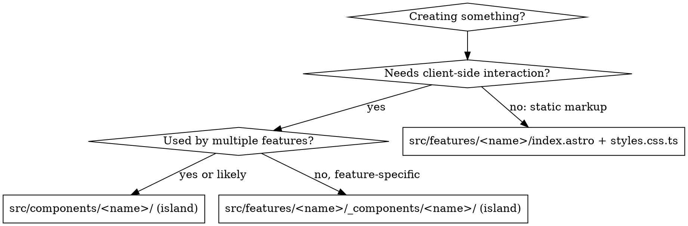

# File Colocation

## Overview

Every file has a home. Styles live next to the thing they style. Routes are thin; page bodies live in `src/features/`; reusable islands live in `src/components/`.

## The Rule

```
src/pages/<route>.astro      → thin route: imports and renders one feature
src/features/<name>/         → index.astro + styles.css.ts (page body)
src/components/<name>/       → index.tsx + styles.css.ts + <name>.test.tsx (React island)
src/features/<name>/*.presenter.ts → mountXxx(el) called from the feature's Astro <script> (rule presenter.md)
src/features/<name>/use-*.ts       → island hook that owns subscriptions (rule presenter.md)
src/**/*.cleanup.ts          → factories that collect and release resources — the only place `push` is allowed (rule idempotent-cleanup.md)
src/shaders/                 → WGSL files (rule shader-files.md)
src/design-system/           → tokens (primitive → semantic → textStyles)
```

`src/pages` treats any sibling `.ts` file as an endpoint, so a `styles.css.ts` must never be placed there — that is why the route is a one-line wrapper.

## Directory Structure

```
src/
  pages/
    index.astro                       # <Top />
  features/
    top/
      index.astro                     # page body, imports * as styles from './styles.css'
      styles.css.ts
  components/
    hero/
      index.tsx                       # island (client:load)
      styles.css.ts
      hero.test.tsx
```

## Decision Flowchart



## styles.css.ts Pattern

Extract Panda CSS styles into a colocated `styles.css.ts` with **named exports**. Consumers use a namespace import.

```ts
// styles.css.ts
import { css } from 'styled-system/css';

export const root = css({ position: 'relative', width: 'full', height: 'screenH' });
export const heading = css({ textStyle: 'display', color: 'fg.default' });
```

```astro
---
// index.astro
import * as styles from './styles.css';
---
<main class={styles.root}>
  <h1 class={styles.heading}>…</h1>
</main>
```

```tsx
// index.tsx
import * as styles from './styles.css';

export const ControlPanel = () => <aside className={styles.root}>…</aside>;
```

## The Three-File Rule (islands)

Every React component directory MUST have exactly three files:

```
<name>/
  index.tsx        # component implementation (required)
  styles.css.ts    # all Panda CSS styles (required, even if small)
  <name>.test.tsx  # tests (required, at minimum a render test)
```

## Red Flags — STOP and Restructure

- Inline `css()` calls in an `.astro` or `.tsx` file → extract to `styles.css.ts`
- `<style>` blocks in `.astro` files → Panda cannot extract them; move to `styles.css.ts`
- A `.ts` file next to `src/pages/*.astro` → it became a route; move it under `src/features/`
- An island importing a browser-only library at module top level while server-rendered → dynamic import from the client boot path
- A feature-specific island imported from another feature → move to `src/components/`

## Common Mistakes

| Mistake                                        | Fix                                         |
| ---------------------------------------------- | ------------------------------------------- |
| Page body written directly in `src/pages`      | Move to `src/features/<name>/index.astro`   |
| Styles inline in component                     | Extract to colocated `styles.css.ts`        |
| `export const styles = { … }` object in css.ts | Use named exports + `import * as styles`    |
| Component directory without `styles.css.ts`    | Always create even if small                 |
| Missing test file                              | Add `<name>.test.tsx` alongside `index.tsx` |
